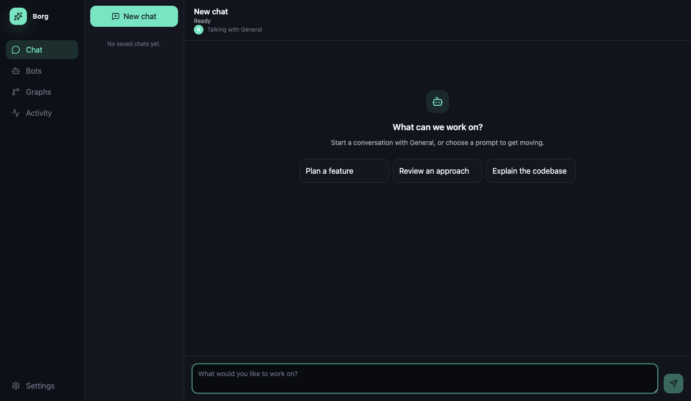

# Borg Agent

Local desktop agent harness. A TypeScript microkernel you bundle plugins with: models, tools, MCP, channels, and graphs.



The product is plugins. Borg Agent is an agentic harness microkernel. It's a minimal, stable core (agent loop, tool dispatch, context, lifecycle, plugin contract) that you bundle plugins with to create domain-specific harnesses. The desktop app is one distribution.

- Model and tool calls go through the kernel, which scans prompts and output, enforces data-classification ceilings, and asks for approval when policy requires it.
- Each plugin declares its version, supported kernel range, permissions, and contributions in a manifest, and the kernel checks it at activation and enforces the permissions on host calls.
- Model providers are plugins, so a harness bundles the ones it needs: Anthropic, OpenAI, Azure, GitHub Copilot, Ollama, OpenRouter, or a scripted mock.
- A distribution names a harness by id and version, pins the kernel range, and lists its plugins, and `createKernel()` rejects one that doesn't fit the running kernel.

**Status:** alpha. The desktop app is the reference distribution. macOS is the primary platform. CI runs typecheck, unit tests, and the Electron end-to-end tests on both macOS and Linux. The packages are not published to npm yet. MIT licensed.

## Run a harness headless

This is `examples/headless/src/main.ts`. It defines a four-plugin distribution, boots the kernel in plain Node, sends one command to the hello plugin, and stops. The kernel needs a config store and a secret store to start, so the distribution bundles `borg.config.sqlite` and `borg.secrets.dev` next to `borg.hello` and the `borg.mock-llm` model provider.

```ts
import { mkdtempSync } from "node:fs";
import { tmpdir } from "node:os";
import { createKernel, defineDistribution } from "@borg/kernel";
import configSqliteManifest from "@borg/plugin-config-sqlite/borg.plugin.json";
import configSqlite from "@borg/plugin-config-sqlite/main";
import helloManifest from "@borg/plugin-hello/borg.plugin.json";
import { helloGetStatus } from "@borg/plugin-hello/contract";
import hello from "@borg/plugin-hello/main";
import mockLlmManifest from "@borg/plugin-mock-llm/borg.plugin.json";
import mockLlm from "@borg/plugin-mock-llm/main";
import secretsDevManifest from "@borg/plugin-secrets-dev/borg.plugin.json";
import secretsDev from "@borg/plugin-secrets-dev/main";

const distribution = defineDistribution({
  id: "example.headless",
  name: "Headless example",
  version: "0.1.0",
  kernel: "^0.1.0",
  plugins: ["borg.config.sqlite", "borg.secrets.dev", "borg.mock-llm", "borg.hello"],
});
const kernel = createKernel({
  distribution,
  plugins: [
    { manifest: configSqliteManifest, loadMain: async () => configSqlite },
    { manifest: secretsDevManifest, loadMain: async () => secretsDev },
    { manifest: mockLlmManifest, loadMain: async () => mockLlm },
    { manifest: helloManifest, loadMain: async () => hello },
  ],
  host: { dataDirectory: mkdtempSync(`${tmpdir()}/borg-headless-`) },
  resolveSecretStore: async () => "borg.secrets.dev",
});
kernel.start()
  .then(() => kernel.bus.invoke(helloGetStatus, {}))
  .then((status) => console.log(`${status.pluginId}: ${status.message}`))
  .finally(() => kernel.stop());
```

After `pnpm build`, run it with `node examples/headless/dist/main.js`. It prints `borg.hello: Kernel alive`. `pnpm test` runs it too, and fails if the block above stops matching the file. The embedding API is in [packages/kernel/README.md](packages/kernel/README.md).

## Quickstart

You need Node.js 22 or newer, from `engines.node` in the root `package.json`, and pnpm 12.0.0, from `packageManager`.

Corepack runs that pinned pnpm without creating global symlinks in `/usr/local/bin`. You can instead install pnpm with `brew install pnpm` and call `pnpm` directly.

```sh
corepack pnpm install
corepack pnpm dev
```

`pnpm dev` runs `pnpm build`, then launches Electron through `scripts/run-electron.mjs`.

Corepack does not read registry or authentication settings from `~/.npmrc`. Behind a custom npm registry, call the pinned package through npm.

```sh
npx --yes pnpm@12.0.0 install
npx --yes pnpm@12.0.0 dev
```

pnpm checks the committed lockfile against its supply-chain policies on every install. The lockfile names no registry host, so the same frozen install works against npmjs or a feed that mirrors it. Private feed setup is in [CONTRIBUTING.md](CONTRIBUTING.md#installing-behind-a-corporate-or-private-npm-feed).

Checks:

```sh
corepack pnpm lint
corepack pnpm typecheck
corepack pnpm test
corepack pnpm test:coverage
corepack pnpm test:e2e
```

`pnpm build` runs `pnpm check:boundaries` before the workspace package builds. `typecheck`, `test`, `test:coverage`, and `test:e2e` each run `pnpm build` first.

## Architecture

**Kernel** (`packages/kernel`, `@borg/kernel`). Agent loops, tool dispatch, the model gateway, the command and event bus, plugin lifecycle, and the classification, scanning, and approval services. `createKernel()` builds a kernel inside any Node process. The package does not import Electron. Depth on the services and the locked design decisions is in [docs/architecture.md](docs/architecture.md).

**Plugin SDK** (`packages/plugin-sdk`, `@borg/plugin-sdk`). What plugin code imports: `definePlugin`, `defineTool`, `defineUiPlugin`, the `PluginContext` type, the manifest schema, and `createTestHarness`.

**Contracts** (`packages/contracts`, `@borg/contracts`). The root export holds `defineCommand`, `defineEvent`, and the schemas the kernel uses, including the MCP server config that personas embed. It defines no plugin commands, and its only event is the kernel-guarded `borg.channel.inboundMessage`. Five subpaths hold schemas that several plugins share: `@borg/contracts/calendar`, `/connector-accounts`, `/contacts`, `/drive`, and `/web-search`. Commands, events, and schemas that belong to one plugin ship from that plugin's `@borg/plugin-<name>/contract` export.

**Plugins** (`plugins/*`). One package per plugin, 35 in total: model providers, message channels, tools, search, MCP, storage, security scanning, and UI features.

**Distributions** (`distributions/*`). `defineDistribution()` definitions that a host passes to `createKernel()`. The tree has one, `borg.desktop` in `distributions/desktop`.

**Desktop app** (`apps/desktop`). The Electron host that runs `borg.desktop`. `tests/e2e` holds its Playwright specs.

**Examples** (`examples/*`). Built and tested with the rest of the workspace. `examples/headless` is the example above.

## Boundaries

`pnpm build` starts with `pnpm check:boundaries`. It fails the build if the kernel, contracts, SDK, or a distribution depends on Electron, if a plugin imports another plugin other than through its `/contract` export, or if a command or event is defined outside a contract module. The full rule list is in [docs/boundaries.md](docs/boundaries.md).

## Write a plugin

[docs/plugin-authoring.md](docs/plugin-authoring.md) walks through `plugins/hello`: the package layout, the manifest, activation and `PluginContext`, the `./contract` export, what a plugin may import, UI registration, tests, and adding a plugin to `borg.desktop`.

## Desktop app

The desktop app runs the `borg.desktop` distribution, which bundles all 35 plugins. Closing the window hides it to the tray. Setup and feature detail is in [docs/desktop.md](docs/desktop.md).

- **First run.** A guided setup verifies secure storage, takes optional provider keys, and picks an assistant. You can skip the cloud providers and use the built-in scripted model. Setup ends in Chat, which shows token and cost totals per conversation. **Settings → Plugins** turns bundled plugins off.
- **MCP and MCP Apps.** MCP servers are configured per persona under **Settings → MCP**, over stdio or HTTP. Every MCP tool call asks for approval. MCP App HTML renders in a sandbox that blocks undeclared network access, nested frames, forms, downloads, and Node access.
- **Search.** Tavily and Brave search tools register once a key is saved. Results are treated as untrusted and require approval.
- **A2A.** A loopback-only JSON-RPC listener, off until you enable it under **Settings → A2A**.
- **Channels.** Discord, Slack, IMAP, Microsoft 365, and Google channel plugins receive and send messages. Their credentials live in the kernel's secret store or OAuth vault.
- **Security model.** Data is classified `public`, `internal`, `confidential`, or `restricted`, and a run's classification only goes up. Each model provider and channel has a ceiling. Prompt scanning, ceiling violations, and tool approval are combined so one operation asks at most once. The text of a denied model output is neither shown nor stored.

### Unsigned macOS package

```sh
corepack pnpm package:mac
corepack pnpm verify:package:mac
```

The first command builds `.package/Borg-darwin-<arch>.zip`. The second launches that app and runs a short smoke check. Both scripts run only on macOS, and the app is not signed or notarized.

The Apple silicon zip is attached to [v0.1.0-alpha](https://github.com/danielgerlag/borg-agent/releases/tag/v0.1.0-alpha).

The guide map is [docs/README.md](docs/README.md).

## License

MIT. See [LICENSE](LICENSE).
